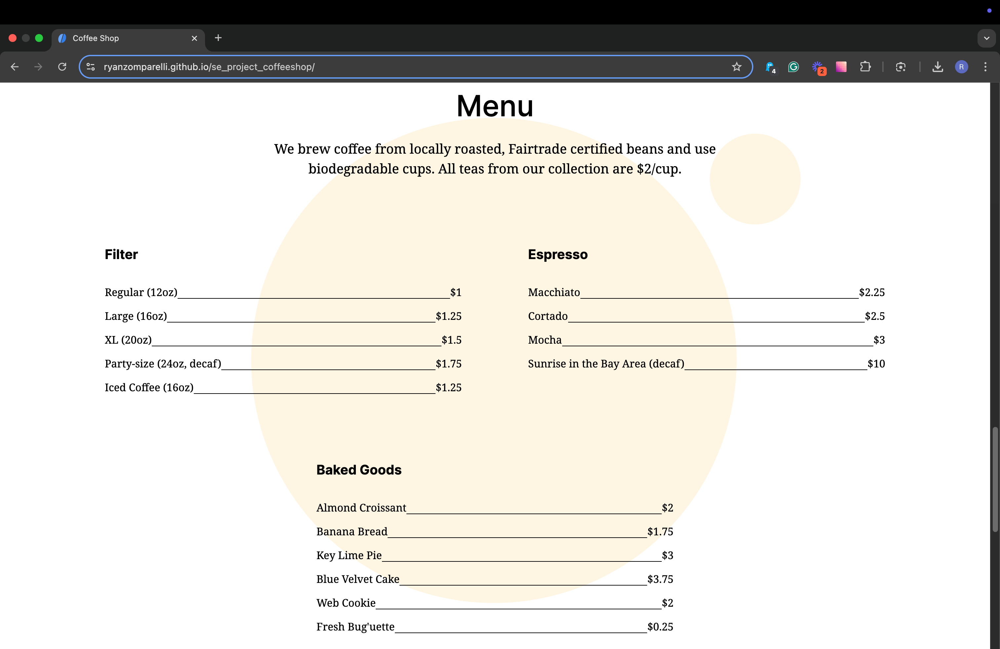
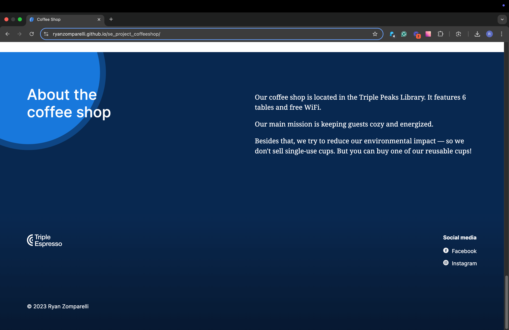

# Triple Peaks Coffee Shop

This is the second project of the Software Engineering program at TripleTen. It was created using HTML and CSS, based on the design brief.

**Check it out** [here](https://ryanzomparelli.github.io/se_project_coffeeshop/)

**Watch a brief presentation** [here](https://www.loom.com/share/b646412ec52346f98a5f741b7cc3e65b?sid=cb2d81b2-1236-431b-ad63-c70feb619eb2)

## Project features

- Semantic HTML5
- Flexbox
- Positioning
- Flat BEM file structure
- A custom form
- CSS animation and transform

## Plan on improving the project

- Currently, the form is not yet functional, but I plan to implement its core functionality using JavaScript. Future updates will also include enhancing the checkbox styling for a better user experience. These improvements will ensure the form is both visually appealing and fully operational.

- Make the page responsive and create a mobile design to implement with media queries.

## Screenshots

The about section features a cool animation!

